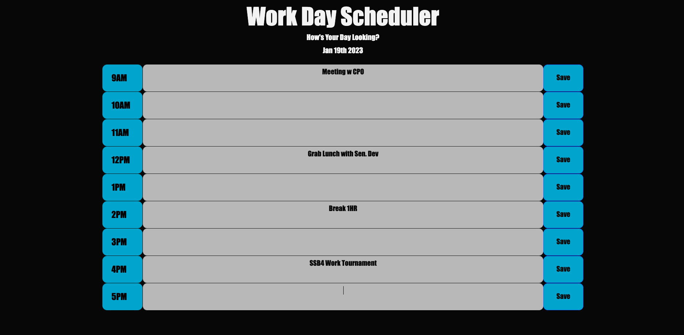

# Prioritysheet
This application is a simple schedule planner that allows users to save their schedule for the day in local storage. The application displays the current date at the top of the page and the hours of the day in a row format, each with a text area and a save button. Users can input their schedule for each hour in the text area and save it by clicking on the save button. The schedule will be saved in local storage and will be rendered back to the text area the next time the user visits the application. Additionally, the application color codes the text areas based on the current time, with past hours being colored in grey, present hour in red, and future hours in green.
## User Story

```md
AS AN employee with a busy schedule
I WANT to add important events to a daily planner
SO THAT I can manage my time effectively
```

## Acceptance Criteria

```md
GIVEN I am using a daily planner to create a schedule
WHEN I open the planner
THEN the current day is displayed at the top of the calendar
WHEN I scroll down
THEN I am presented with timeblocks for standard business hours
WHEN I view the timeblocks for that day
THEN each timeblock is color coded to indicate whether it is in the past, present, or future
WHEN I click into a timeblock
THEN I can enter an event
WHEN I click the save button for that timeblock
THEN the text for that event is saved in local storage
WHEN I refresh the page
THEN the saved events persist
```

## Installation
No Install Needed. You can access the webpage through the link below.

https://jbxamora.github.io/prioritysheet/



## Code Snippets

### Local Storage

```js
function saveText(input, hour) {
  var schedule = JSON.parse(localStorage.getItem("schedule"));
  if (!schedule) {
    initLocalStorage();
    schedule = JSON.parse(localStorage.getItem("schedule"));
  }
  schedule[hour] = input;
  localStorage.setItem("schedule", JSON.stringify(schedule));
}
```


### Append Elements to Container || Setting up Save Button Event


```js
function createText() {
  for (var [i, mHour] of Object.entries(mHours)) {
    var newDiv = $("<div>").addClass("row");
    var textArea = $("<textarea>").addClass(mHour + " col-xl-10 " + hours[i]);
    var button = $("<button>")
      .addClass("btn btn-primary saveBtn col-xl-1")
      .text("Save");
    var timeBlock = $("<span>")
      .addClass("col-xl-1 time-block hour")
      .text(hours[i]);
    // Append all elements to the container
    container.append(newDiv.append(timeBlock).append(textArea).append(button));
    // Set up the click even for the save button
    button.on("click", function (event) {
      var input = $(event.target).siblings("textarea").val();
      var hour = $(event.target)
        .siblings("textarea")
        .attr("class")
        .split(" ")[0];
      saveText(input, hour);
    });
  }
  renderLocalStorage();
}
```

## License

MIT License

Copyright (c) [2022] [Jorge Zamora]

Permission is hereby granted, free of charge, to any person obtaining a copy
of this software and associated documentation files (the "Software"), to deal
in the Software without restriction, including without limitation the rights
to use, copy, modify, merge, publish, distribute, sublicense, and/or sell
copies of the Software, and to permit persons to whom the Software is
furnished to do so, subject to the following conditions:

The above copyright notice and this permission notice shall be included in all
copies or substantial portions of the Software.

THE SOFTWARE IS PROVIDED "AS IS", WITHOUT WARRANTY OF ANY KIND, EXPRESS OR
IMPLIED, INCLUDING BUT NOT LIMITED TO THE WARRANTIES OF MERCHANTABILITY,
FITNESS FOR A PARTICULAR PURPOSE AND NONINFRINGEMENT. IN NO EVENT SHALL THE
AUTHORS OR COPYRIGHT HOLDERS BE LIABLE FOR ANY CLAIM, DAMAGES OR OTHER
LIABILITY, WHETHER IN AN ACTION OF CONTRACT, TORT OR OTHERWISE, ARISING FROM,
OUT OF OR IN CONNECTION WITH THE SOFTWARE OR THE USE OR OTHER DEALINGS IN THE
SOFTWARE.

## Badges

<a href=”https://www.linkedin.com/in/jorge-zamora-786945250/”>


## Contributing

Pull requests are welcome. For major changes, please open an issue first to discuss what you would like to change. If the issue goes unresolved for more than a week feel free to contact me at any of the links listed below. Be sure to add me on LinkedIn and Follow me on GitHub to view my course progression. You can also visit the deployed site and sent a messafe through the contact form.

[](https://github.com/jbxamora)  [](https://www.linkedin.com/in/jorge-zamora-786945250//)  [](https://www.instagram.com/jbxamora/)  [](https://stackoverflow.com/users/20023706/jbxamora)